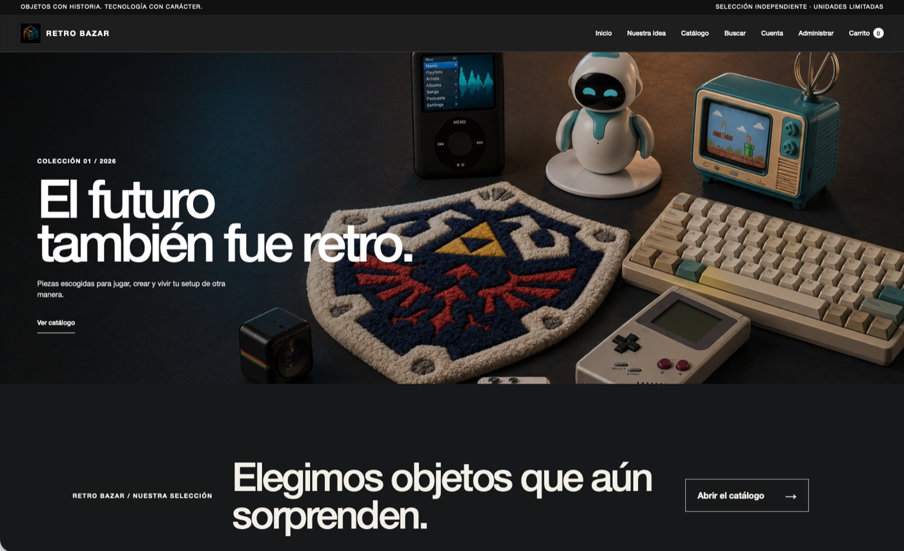
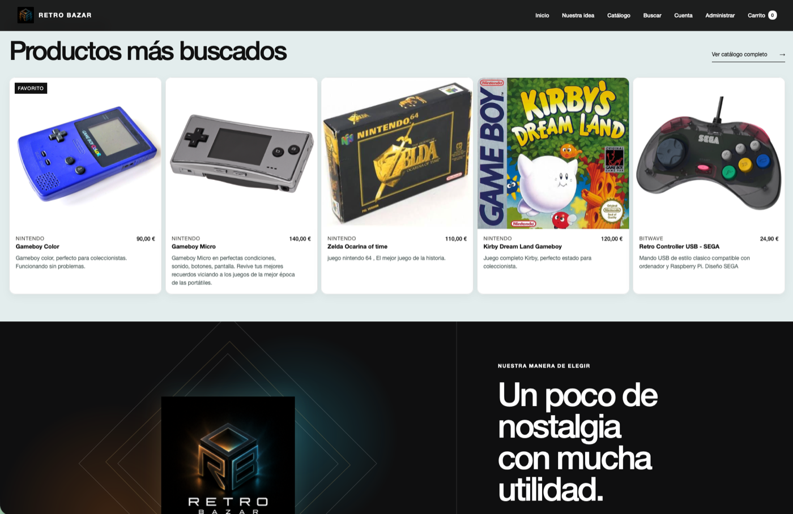
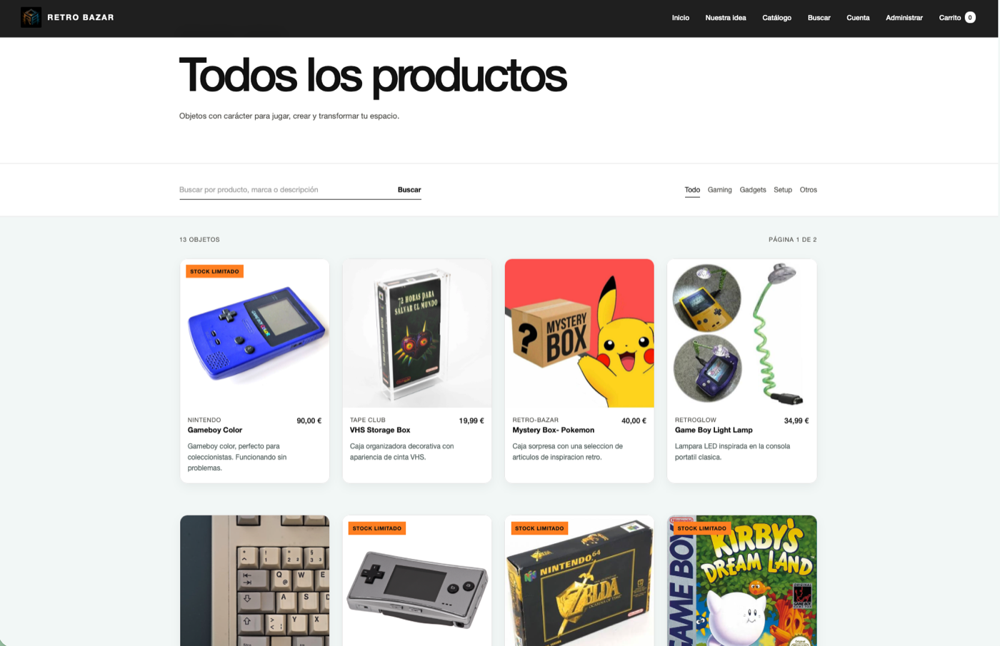
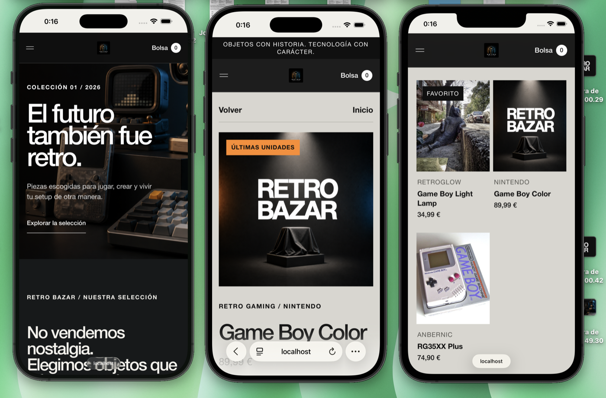
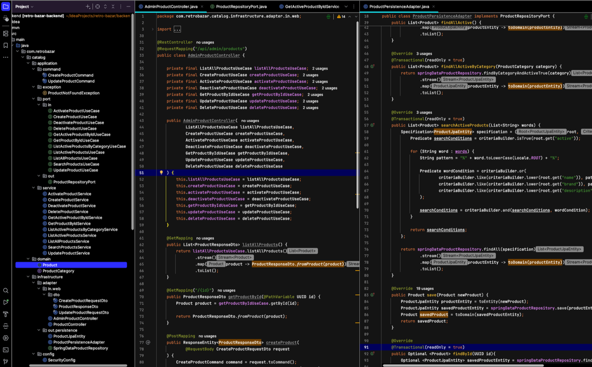

<div align="center">
  

  # Retro Bazar

  **E-commerce de productos retro, gaming, gadgets y accesorios para setups.**
</div>

## Estado del proyecto

Retro Bazar es un monolito modular en desarrollo. La primera versión funcional
del catálogo ya permite consultar productos reales desde una interfaz Angular
conectada a una API REST desarrollada con Spring Boot.

El repositorio contiene actualmente:

- Un catálogo público con listado, búsqueda, filtros por categoría y detalle.
- Gestión administrativa de productos mediante la API.
- Activación, desactivación y eliminación de productos.
- Validación de peticiones y respuestas de error estructuradas.
- Una interfaz responsive preparada como MVP visual.
- Diez productos de demostración distribuidos en cuatro categorías.

Las siguientes fases incorporarán el agente de producto, cuentas de usuario,
listas de deseos, carrito y pedidos pendientes de pago. También se estudia una
salida opcional a Wallapop y un módulo para gestionar ventas en ferias.

## Visión del producto y alcance del MVP

Retro Bazar se plantea como un e-commerce evolutivo. La aplicación reunirá el
catálogo, la administración, las cuentas de usuario, los favoritos, el carrito y
los pedidos.

El flujo principal previsto es:

```text
Descubrir en Retro Bazar
        ↓
Guardar productos o añadirlos al carrito
        ↓
Confirmar un pedido
        ↓
Esperar el contacto del gestor para acordar el pago
```

Al confirmar el carrito, el pedido se guardará como `PENDING_PAYMENT`. Retro
Bazar no procesará todavía el pago: un comercial contactará con el cliente para
acordarlo. La cuenta permitirá consultar favoritos, carrito e historial de
pedidos.

### Opciones de compra previstas

- **Pedido en Retro Bazar:** el cliente confirma el carrito y se registra un
  pedido pendiente de pago.
- **Salida a Wallapop:** opcionalmente, un producto podrá enlazar al anuncio del
  gestor de la tienda mediante «Comprar en Wallapop».

La integración con Wallapop utilizaría únicamente enlaces públicos mantenidos
por el administrador. Retro Bazar no solicitará credenciales de Wallapop ni
automatizará la plataforma mediante scraping o APIs privadas. El pago, el envío
y las disputas de esa opción se gestionarían fuera de Retro Bazar, de acuerdo
con las [condiciones de uso de Wallapop](https://about.wallapop.com/condiciones-de-uso/).

## Vista de la aplicación

### Portada

<p align="center">
  
</p>

### Catálogo y selección

<table>
  <tr>
    <td width="50%">
      
    </td>
    <td width="50%">
      
    </td>
  </tr>
  <tr>
    <td align="center"><strong>Selección destacada</strong></td>
    <td align="center"><strong>Catálogo, filtros y búsqueda</strong></td>
  </tr>
</table>

### Experiencia responsive

<p align="center">
  
</p>

## Tecnologías

### Backend

- Java 21.
- Spring Boot 4.1.
- Spring Web MVC.
- Spring Data JPA y Hibernate.
- Spring Security.
- Bean Validation.
- MySQL.
- Springdoc OpenAPI y Swagger UI.
- Maven.
- JUnit, Mockito y Testcontainers.

### Frontend

- Angular 20.
- TypeScript.
- Angular Router.
- HttpClient, Signals y RxJS.
- HTML y CSS responsive.

## Arquitectura

El backend utiliza arquitectura hexagonal dentro de un monolito modular. Cada
módulo funcional se divide progresivamente en:

- **Dominio:** entidades y reglas del negocio independientes de Spring.
- **Aplicación:** casos de uso, comandos y puertos de entrada y salida.
- **Infraestructura:** controladores REST, persistencia, seguridad y
  configuración externa.

Los módulos previstos para la primera versión son `catalog`, `productagent`,
`user`, `wishlist`, `cart` y `order`. El módulo `event` queda documentado como
una posible ampliación. `shared` contiene soporte técnico común y no representa
un módulo de negocio.

La infraestructura web común contiene el gestor global que transforma las
excepciones de aplicación y los errores HTTP en respuestas consistentes.

```text
retro-bazar/
├── backend/
│   └── src/
│       ├── main/java/com/retrobazar/
│       │   ├── catalog/        # Productos, categorías, precios y stock
│       │   ├── productagent/   # Valoración y mejora de fichas con IA
│       │   ├── user/           # Cuentas, autenticación, perfil y roles
│       │   ├── wishlist/       # Productos favoritos de cada usuario
│       │   ├── cart/           # Carrito persistente y cantidades
│       │   ├── order/          # Confirmación e historial de pedidos
│       │   ├── event/          # Posible gestión futura de ferias
│       │   └── shared/web/error/
│       └── test/
├── frontend/
│   └── src/app/
└── README.md
```

<p align="center">
  
</p>

<p align="center"><em>Puertos, casos de uso y adaptadores del módulo de catálogo.</em></p>

## Requisitos para desarrollo local

- JDK 21.
- Docker Desktop (recomendado para ejecutar MySQL 8.4) o una instalación local de MySQL 8.
- Node.js y npm.

Docker Compose se utiliza únicamente para la base de datos de desarrollo. El
backend y el frontend se siguen ejecutando directamente desde la terminal o el
IDE. No se han creado imágenes Docker para las aplicaciones.

## Configuración del backend

El backend reconoce estas variables de entorno:

| Variable | Valor local por defecto | Descripción |
|---|---|---|
| `DB_URL` | `jdbc:mysql://localhost:3307/retro_bazar?...` | Conexión con MySQL de Docker |
| `DB_USERNAME` | `root` | Usuario de la base de datos |
| `DB_PASSWORD` | `retro_bazar_local` | Contraseña local de la base de datos |
| `FRONTEND_ORIGIN` | `http://localhost:4200` | Origen permitido por CORS |

[`backend/.env.example`](backend/.env.example) documenta estas variables sin
incluir credenciales reales. Spring Boot no carga archivos `.env`
automáticamente: las variables deben configurarse en IntelliJ, en la terminal o
mediante la herramienta utilizada para ejecutar la aplicación.

Con Docker Desktop iniciado, levantar MySQL:

```bash
docker compose up -d
```

El contenedor crea la base de datos `retro_bazar`, escucha únicamente en
`localhost:3307` y conserva los datos en un volumen. Se utiliza el puerto 3307
para no interferir con una posible instalación local de MySQL en el 3306. Para
consultar su estado o detenerlo:

```bash
docker compose ps
docker compose down
```

`docker compose down` no elimina los datos. Solo se borran explícitamente con
`docker compose down --volumes`.

Si se utiliza una instalación local de MySQL en lugar de Docker, crear la base
de datos manualmente:

```sql
CREATE DATABASE retro_bazar;
```

Arrancar el backend:

```bash
cd backend
./mvnw spring-boot:run
```

La API se sirve en `http://localhost:8080`.

## Ejecución del frontend

Con el backend iniciado:

```bash
cd frontend
npm install
npm start
```

La aplicación se sirve en `http://localhost:4200`.

## API del catálogo

### Endpoints públicos

| Acción | Método | Endpoint |
|---|---|---|
| Listar productos activos | `GET` | `/api/products` |
| Filtrar por categoría | `GET` | `/api/products/category/{category}` |
| Buscar productos | `GET` | `/api/products/search?text={text}` |
| Consultar un producto activo | `GET` | `/api/products/{id}` |

### Endpoints administrativos

| Acción | Método | Endpoint |
|---|---|---|
| Listar todos los productos | `GET` | `/api/admin/products` |
| Consultar un producto | `GET` | `/api/admin/products/{id}` |
| Crear un producto | `POST` | `/api/admin/products` |
| Actualizar un producto | `PUT` | `/api/admin/products/{id}` |
| Eliminar un producto | `DELETE` | `/api/admin/products/{id}` |
| Activar un producto | `PATCH` | `/api/admin/products/{id}/activate` |
| Desactivar un producto | `PATCH` | `/api/admin/products/{id}/deactivate` |

La documentación interactiva está disponible con el backend iniciado en:

```text
http://localhost:8080/swagger-ui/index.html
```

Los endpoints administrativos permanecen temporalmente abiertos hasta que se
implemente el módulo de usuarios y autorización por roles.

## Pruebas

Ejecutar las pruebas del backend:

```bash
cd backend
./mvnw test
```

Las pruebas unitarias no requieren Docker. La prueba de carga completa del
contexto utiliza Testcontainers y necesita un entorno Docker disponible. Esta
infraestructura se completará en una fase posterior. Para el desarrollo habitual,
la aplicación se ejecuta contra el MySQL levantado mediante Docker Compose.

Comprobar el frontend:

```bash
cd frontend
npm run build
```

## Agente de IA para el alta de productos

El formulario administrativo ofrecerá la acción «Valorar con IA». A partir del
título, descripción, precio e imágenes introducidos, el agente propondrá una
ficha mejorada antes de crear el producto.

La implementación prevista utilizará Spring AI y Gemini. El agente podrá buscar
referencias públicas de precio y comparar el artículo con productos existentes
en el catálogo.

### Flujo previsto

1. El administrador completa el formulario y añade una o varias imágenes.
2. El agente analiza la información y busca referencias.
3. Un diálogo compara los valores originales con la propuesta.
4. El administrador decide si aplica el nuevo título, descripción y precio.
5. El producto solo se guarda al confirmar el formulario habitual.

La valoración mostrará un precio orientativo, sus referencias y posibles
coincidencias del catálogo. El agente no tendrá acceso directo a la base de datos
ni podrá crear, modificar o eliminar productos.

## Gestión futura de eventos

El módulo `event` es una posible ampliación y no está confirmado para la primera
versión. Permitirá preparar la asistencia de la tienda a ferias o mercadillos.

El propietario podrá crear un evento con imagen, ubicación y fechas; seleccionar
los productos y cantidades que llevará; registrar ventas presenciales; y
consultar las unidades vendidas, el stock restante y los ingresos obtenidos.

La política para reservar, descontar y devolver el stock general se decidirá al
diseñar este módulo.

## Hoja de ruta

1. **Estructura del frontend — completado.** La portada vive en un
   `HomeComponent` enrutado y `AppComponent` conserva únicamente el layout y la
   interacción global.
2. **Catálogo público — completado.** `/catalogo` ofrece búsqueda, filtros por
   categoría y paginación de diez productos en Angular. La portada mantiene una
   selección reducida y enlaza al catálogo completo.
3. **Administración abierta de demostración — completado.** El panel permite
   listar con filtros y paginación, crear, editar, activar, desactivar y eliminar
   productos utilizando los endpoints actuales.
4. **Catálogo administrable — completado.** Los productos, descripciones e
   imágenes se mantienen desde el panel mediante URLs públicas. `data.sql` se
   conserva como catálogo inicial de referencia, pero no se ejecuta
   automáticamente sobre la base de datos local.
5. **Agente de producto.** Valorar los datos e imágenes del formulario, consultar
   referencias, detectar posibles coincidencias y ofrecer una propuesta editable.
6. **Autenticación y autorización.** Añadir usuarios, login y roles; proteger las
   rutas administrativas de Angular y los endpoints `/api/admin/**`.
7. **Listas de deseos.** Permitir que cada usuario mantenga una selección personal
   persistente y sincronizada entre sesiones y dispositivos.
8. **Carrito y pedidos.** Mantener un carrito por usuario y registrar pedidos
   pendientes de pago, con gestión posterior por parte de la tienda.
9. **Canal externo opcional.** Permitir que determinados productos enlacen al
   anuncio correspondiente de la cuenta de Wallapop del gestor.
10. **Eventos — por decidir.** Gestionar el stock y las ventas presenciales en
    ferias, si entra finalmente en el alcance de la primera versión.
11. **Preparación para publicación.** Configurar los entornos de Angular, añadir
   Dockerfiles para backend y frontend, ampliar Docker Compose y preparar el
   despliegue público.

## Alcance

El proyecto es una demostración técnica. Inicialmente registrará pedidos
pendientes de pago, pero no procesará pagos ni envíos reales.
